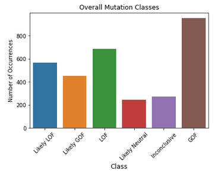
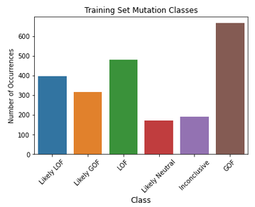
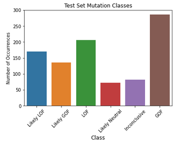
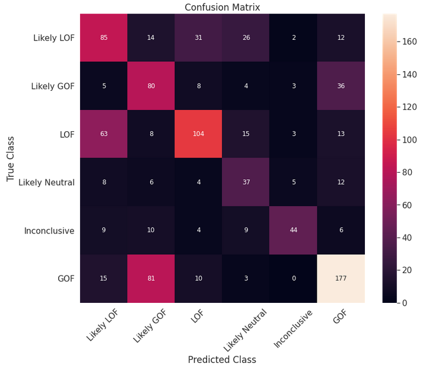
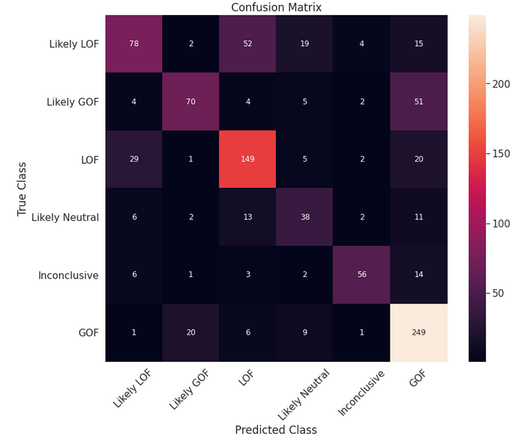
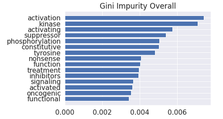
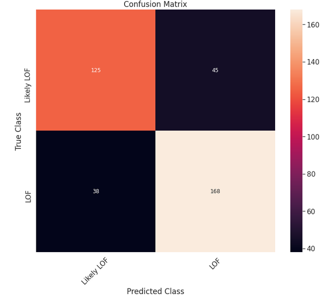
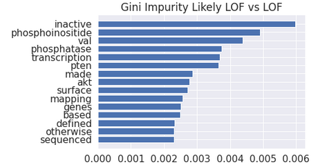

# 
 Using Scientific Literature to Classify Mutations in Tumors 

## Introduction

### Background

Cancer, genetics, and data have are topics that have fascinated me my entrie life. Cancer develops when mutations in DNA cause cells to grow and divide out of control. This is particularly likely when mutations happen in two different kinds of genes. The first is proto-oncogenes. These genes are generally involved in cell growth and division. When they get mutated they can cause cells to continusously grow and divide beyond the point at which our body needs it. The other kind of gene in which mutations are particularly likely to cause cancer are in tumor-suppresor genes. As the name implies, when they are functional, they actively prevent the formation of cancerous tumors. They work by regulating our how rapidly and often cells grow and divide. When it's time to stop cell division, tumor-supressor genes kick in and stop that process. Proto-oncogenes and tumor supressor genes are both vital to our grwoth and development as humans, but because of the roles they play in our biology, we are particularly vunerable to cancer when they sustain mutations.

To understand how mutations in genes disrupt our biological processes, a little more background is required. DNA is organized into genes, which code for specific proteins. Proteins are what perform many the essential biological functions that keep us alive, everything from catalyzing reactions, to transporting molecules (like oxygen), and transmitting messages between cells. Without these proteins, we would not be able function as we do. Mutations in genes can lead to the productin of proteins with unpredictable consequences. Proteins may not be able to perform their necessary function, or they may perform a completely different function than they are intended to. They main even gain an additional function. Therefore, there are several different types of mutation classes. These are listed below:

* Loss-of-function (LOF)
* Likely loss-of-function
* Gain-of-function (GOF)
* Likely gain-of-function
* Change-of-function (COF)
* Likely change-of-function
* Neutral
* Likely neutral
* Inconclusive

### Motivation and goal

With the recent advances in genetic sequencing, personalized medicine based on a person's genome is rapidly becoming a realistic strategy to treat diseases. This means we can take a person's genome, and prophylactically treat them based on whether or not we think a certain disease (in our case, cancer) is likely to develop. However, there are thousands of mutations in any one person's DNA. Sorting through all the mutations and determining which ones are active in causing cancer and which ones are neutral, or "along for the ride" is an extremely important task. However, currently this requires pathologists to manually review the scientific literature relating to each mutation and determine its classification. This can be a long and tedious process.

Therefore, the goal of this project is to utilize natural language processing and develop a machine learning model that can look through the research literature and classify the mutations for us.

## Data

### Overall data set

The data set was provided to [Kaggle](https://www.kaggle.com/c/msk-redefining-cancer-treatment/data) by the Memorial Sloan Kettering Cancer Center (MSKCC). It contained 3,321 mutations in the 9 classes listed above. The change-of-function, likely change-of-function, and neutral classes had substantially fewer observations than the rest, and I chose to remove them. There were also five observations that did not contain any actual text from literature, so those were removed as well. After the data preprocessing, 3,171 values from 6 classes remained, listed below.

* Likely LOF: 566
* Likely GOF: 452
* LOF: 686
* Likely neutral: 242
* Inconclusive: 273
* GOF: 952

### Features and data example

There were only a handful of freatures in this data set.

* Gene in which the mutation exists
* Mutation within in the gene
* Class of mutation
* Research text

Shown below is an example of one of the data points in this data set.

* Gene: Casitas B-lineage lymphoma (*CBL*)
* Mutation: L399V
    * This is a missense mutation at the 399th position in the *CBL* gene. At this position, the gene should code for the amino acid leucine, but the mutation causes it to code for the amino acid valine instead.
* Class: LOF
    * This mutation results in the protein that is coded from the *CBL* gene being unable to perform its required function.
* Research text: "Oncogenic mutations in the monomeric Casitas B-lineage lymphoma (Cbl) gene have been found in many tumors but their significance remains largely unknown. Several human c-Cbl (CBL) structures have recently been solved depicting the protein at different stages of its activation cycle and thus provide mechanistic insight underlying how stability-activity tradeoffs in cancer-related proteins may influence disease onset and progression. In this study..."

### Training and testing sets

The data set was split into a training set to build the models and a test sets to evaluate them.

The training set had 2,219 observations.

* Likely LOF: 396
* Likely GOF: 316
* LOF: 480
* Likely neutral: 170
* Inconclusive: 191
* GOF: 666

The test set had 952 observations.

* Likely LOF: 396
* Likely GOF: 316
* LOF: 206
* Likely neutral: 170
* Inconclusive: 191
* GOF: 286

## Results

### Naive Bayes Overall Model

The first model applied is the Naive Bayes model. This model was chosen first because it is a good model for text classification.

The Naive Bayes model classified the test data set with an accuracy of 55.4%. The confusion matrix for this model is shown below.

### Random Forest Overall Model

The next model applied is the Random Forest model. This is a classification model that is likely to improve on the results from the Naive Bayes model.

The Random Foreset model improved the accuracy of classifications to 67.2%. This is a respectable accuracy for classifying data processed with natural language processing. The confusion matrix for this model is shown below.

The graph of the gini impurity below shows the top 15 most important words the model used when distinguising between classes.

Some of the included words require further investigation, but some of them do stand out. The first thing to notice is that three different forms of the word "activate" are included in the plot (activation, activating, activated). This words are likely present becuase when proto-oncogenes get over activated and continue unchecked, cancer is likely to develop, as is described in the background section of the introduction. The other notable word in this list is suppressor. The consequences of mutations in tumor-suppressor genes are described in the same section.

Other notable words include:
* Nonsense - this is a kind of mutation that causes a protein to stop being created. This results in a partially constructed protein.
* Oncogenic - meaning cancerous

While this model improved the classification, it was not perfect. A look at the confusion matrix above show reveals two areas in particular where the model struggled to distinguish between two classes and had several misclassifications. The first was distinguishing between the "loss-of-function" and the "likely loss-of-function" classes. The second was "gain-of-function" and "likely gain-of-function" classes. It makes intuitive sense that these would be the classes that the model struggles with the most because they are the closest together and toughest to distinguish between. Therefore, another model investigates one of these specific classes below.

### Random Forest LOF vs Likely LOF Model

To further investigate the results, a random forest model was constructed that only looked at two classes which the original model struggled to tell apart. These were the loss-of-function and likely loss-of-function models. When the other four classes were stripped away, this model distinguised between remianing two classes with an accuracy of 77.9%. This is a big improvment over the previous model. The confusion matrix is shown below.

The graph of the gini impurity below shows the top 15 most important words the model used when distinguising between the two classes.

As with the overall model, several of the included words require further investigation. The first word to notice in this chart is the top one, "inactive." This is particularly notable because when there is a loss-of-funciton mutation, that means protein produced from that gene is unable to perform its function. This makes that gene inactive. The other word to notice is *PTEN*. This is the phosphatase and tensin homolog gene and is a known tumor-suppressor that when mutated, is associated with several types of cancer, including glioblastoma, lung cancer, breast cancer, and prostate cancer.

## Future Steps

There are several ways in which I would like to take this project further.

* I would like to analyze the other top words and determine how they are aiding in the classification process.
* Focus closer on the impacts of these mutations by re-classifying the mutations to whether or not they are cancer causing.
* Apply this model to other literature that is not included in this data set.

