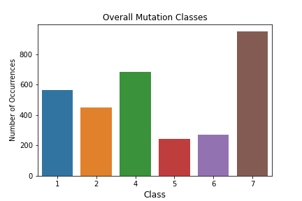

# 
 Using Scientific Literature to Classify Mutations in Tumors 

## Introduction

### Background

Cancer, genetics, and data have are topics that have fascinated me my entrie life. Cancer develops when mutations in DNA cause cells to grow and divide out of control. This is particularly likely when mutations happen in two different kinds of genes. The first is proto-oncogenes. These genes are generally involved in cell growth and division. When they get mutated they can cause cells to continusously grow and divide beyond the point at which our body needs it. The other kind of gene in which mutations are particularly likely to cause cancer are in tumor-suppresor genes. As the name implies, when they are functional, they actively prevent the formation of cancerous tumors. They work by regulating our how rapidly and often cells grow and divide. When it's time to stop cell division, tumor-supressor genes kick in and stop that process. Proto-oncogenes and tumor supressor genes are both vital to our grwoth and development as humans, but because of the roles they play in our biology, we are particularly vunerable to cancer when they sustain mutations.

To understand how mutations in genes disrupt our biological processes, a little more background is required. DNA is organized into genes, which code for specific proteins. Proteins are what perform many the essential biological functions that keep us alive, everything from catalyzing reactions, to transporting molecules (like oxygen), and transmitting messages between cells. Without these proteins, we would not be able function as we do. Mutations in genes can lead to the productin of proteins with unpredictable consequences. Proteins may not be able to perform their necessary function, or they may perform a completely different function than they are intended to. They main even gain an additional function. Therefore, there are several different types of mutation classes. These are listed below:

* Loss-of-function (LOF)
* Likely loss-of-function
* Gain-of-function (GOF)
* Likely gain-of-function
* Change-of-function (COF)
* Likely change-of-function
* Neutral
* Likely neutral
* Inconclusive

### Motivation and goal

With the recent advances in genetic sequencing, personalized medicine based on a person's genome is rapidly becoming a realistic strategy to treat diseases. This means we can take a person's genome, and prophylactically treat them based on whether or not we think a certain disease (in our case, cancer) is likely to develop. However, there are thousands of mutations in any one person's DNA. Sorting through all the mutations and determining which ones are active in causing cancer and which ones are neutral, or "along for the ride" is an extremely important task. However, currently this requires pathologists to manually review the scientific literature relating to each mutation and determine its classification. This can be a long and tedious process.

Therefore, the goal of this project is to use natural language processing and develop a machine learning model that can look through the researc literature and classify the mutations for us.

## Data

The data set was provided to [Kaggle](https://www.kaggle.com/c/msk-redefining-cancer-treatment/data) by the Memorial Sloan Kettering Cancer Center (MSKCC). It contained 3,321 mutations in the 9 classes listed above. The change-of-function, likely change-of-function, and neutral classes had substantially fewer observations than the rest, and I chose to remove them. There were also five observations that did not contain any actual text from literature, so those were removed as well. After the data preprocessing, 3,171 values from 6 classes remained, shown below in the graph.

